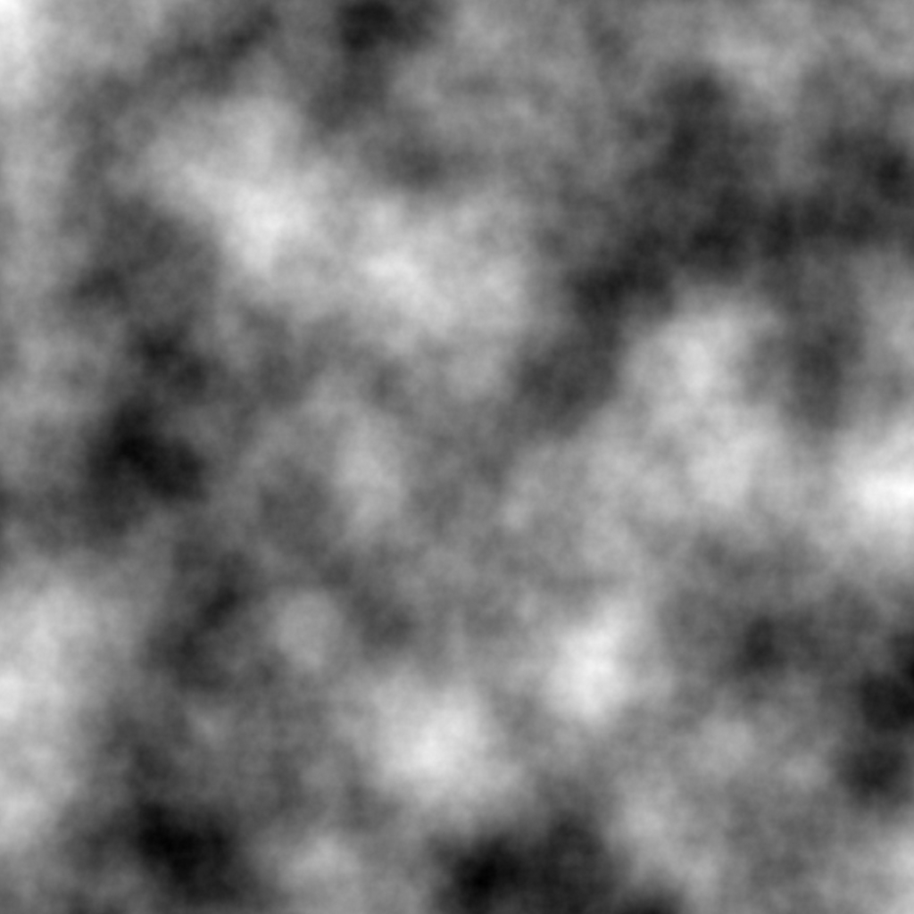
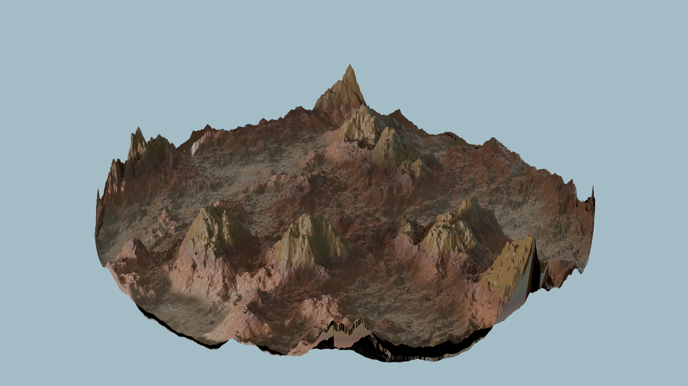
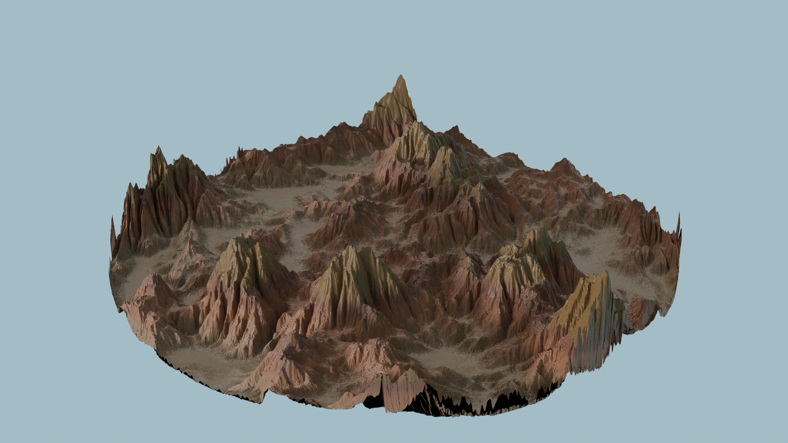
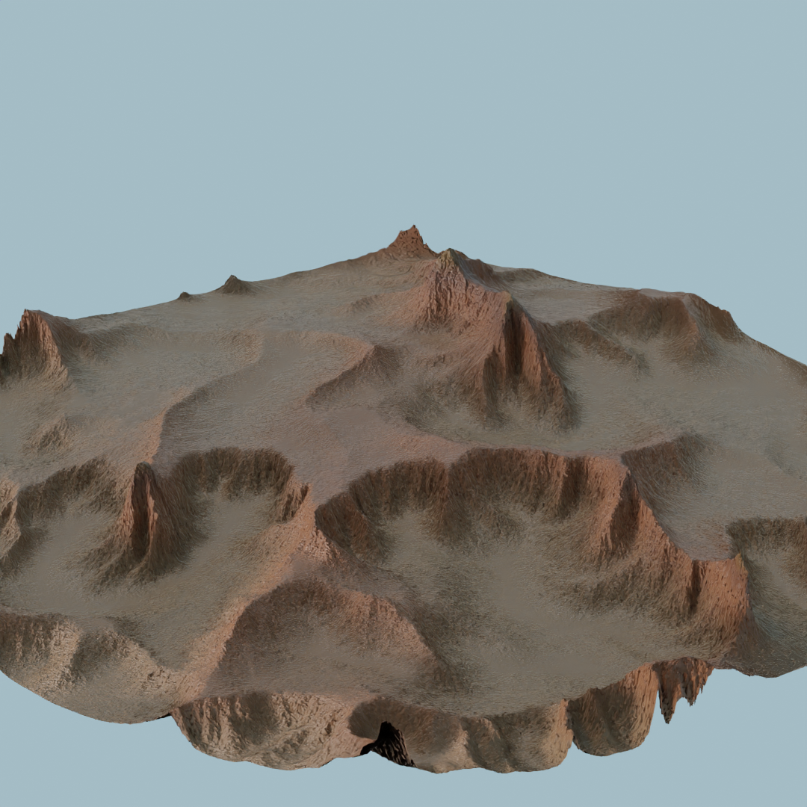
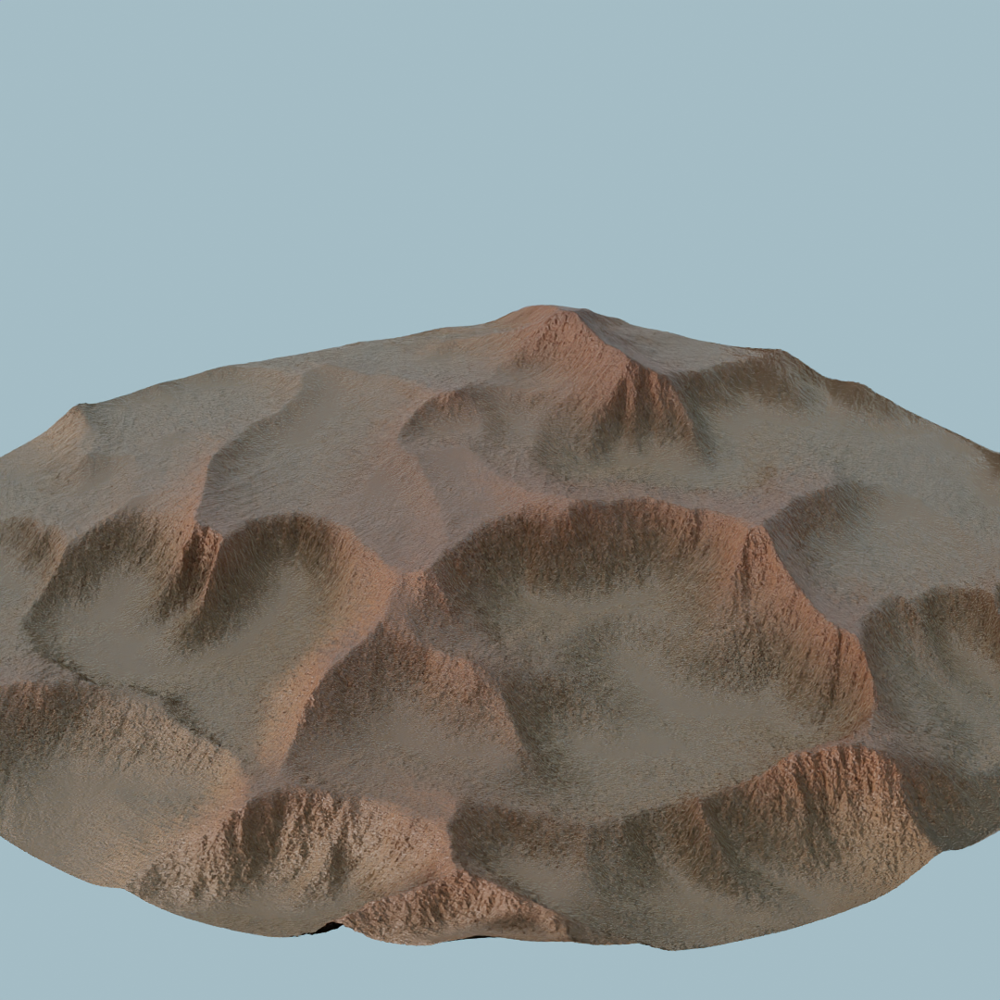
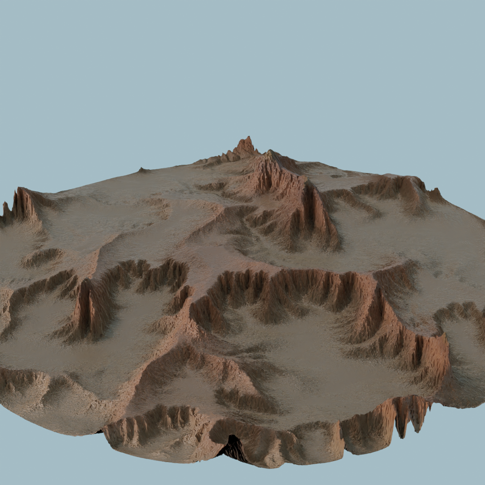

# Terrain generator

The terrain generator creates a base heightmap using layered perlin noise,
where each layer is at multiple frequency (harmonics). The resulting
heightmaps look like this:

This renders terrain like:

# Erosion

To make terrain more realistic, the terrain generator can simulate erosion.
There are various papers that provide implementations which this terrain
generator is based on, plus smaller modification for convenience and/or to
achieve desired results.

The gist of the algorithm is to drop a rain particle at a random location
for every iteration. (Parameters of the model are in **bold**):

- The rain particle, starting with a certain **terminal velocity**, hits
  the ground and moves towards a random direction.
- As the particle moves, the speed and direction of the particle are
  affected by the slope (gradient) of the terrain, the **gravity**, its
  mass (**parameterizable starting range**) and **inertia**.
- As the particle moves, it removes sediment with a certain **erosion
  rate**, from its previous location up to its **capacity**, and deposits
  part of the carried sediment at the next location, spreading it across a
  certain **deposition radius**.
- The mass of the particle increases when it picks sediment up, and reduces
  every step according to an **evaporation rate**.
- The simulation stops when the particle has stopped, has lost all its mass
  (below an hard-coded threshold) or has moved for enough iterations (
  hard-coded to minimum between map width and height).

#### Results:

Note the fjord-like structures that emerge. The erosion patterns can be
affected by many parameters.

## Erosion parameters exploration

### Inertia

Inertia affects how far a particle moves from its dropping point. High
inertia values result in "washed away" flat-ish landscapes, similar to flat
sand dunes. Low inertia values result in very steep ridges on mountain
sides.

The erosion algorithm can be started from an already eroded heightmap to
combine several effects and reach different results. In the below examples,
layering low inertia after high inertia erosion, creates a nice flat-ish
landscape with plateaus whose sides are then eroded by low-inertia
particles creating interesting ridges and cliffs.

#### Inertia = 0.01, 500K particles:

#### Inertia = 0.03, 500K particles:

#### Double pass (1) Inertia = 0.01, 500K particles (2) Inertia = 0.001, 200K particles

